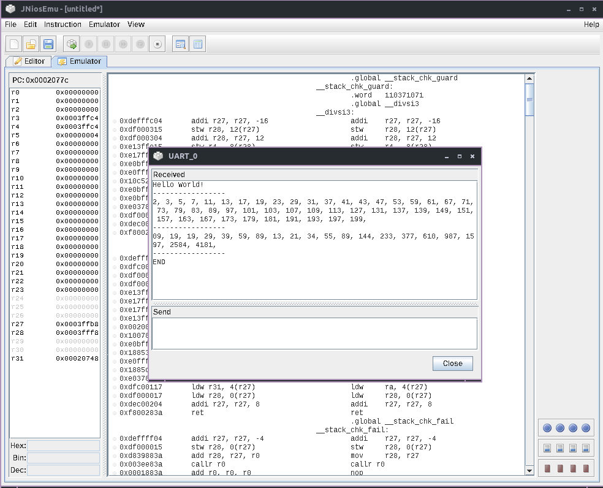

# Collection of C / Assembly programs for Altera Nios II

Cross-compilation toolchain from
[toolchains.bootlin.com](https://toolchains.bootlin.com/releases_nios2.html), compiled under Linux with GCC 11.2.1

For use with [JNiosEmu](https://github.com/stpe/jniosemu)

> Hint: If the assembled program uses builtin or stdlib functions, you may have to turn down the optimization level.

## Example (helloworld-primes-fib.{c,s}):

